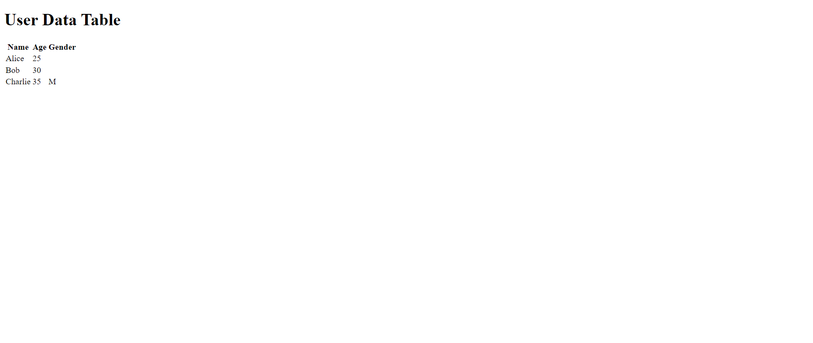

This project is a part of Gramener Assessment. Now I am writing this readme for your understanding.
This setup will dynamically render the JSON data (an array) as an HTML table in the browser.The JavaScript will import the function from your GitHub Pages URL, convert the JSON data to HTML.

- Dashboard

